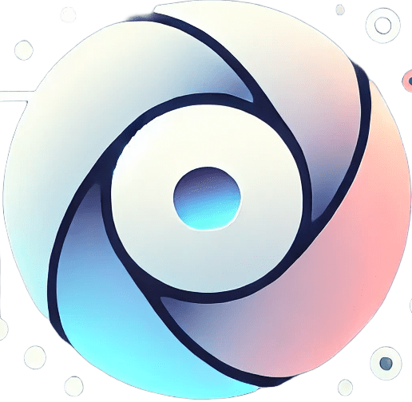

# 🧠 Anto - Sitio Web Oficial

Sitio web moderno y profesional para **Anto**, aplicación móvil de bienestar emocional con IA (**versión app Expo: 1.2.2**). Desarrollado con **Next.js 14**, TypeScript, y optimizado para rendimiento, accesibilidad y SEO.



## 📋 Sobre Anto

**Anto** es una aplicación móvil de salud mental que utiliza inteligencia artificial para ofrecer **apoyo emocional personalizado**. **No sustituye** la atención de un profesional de la salud mental ni proporciona diagnóstico clínico. La aplicación ofrece:

- 🤖 **Asistente de IA (bienestar emocional)**: Chat con OpenAI **GPT-5 Mini**, con tono **profesional y práctico** por defecto (orientación, micro-pasos y preguntas concretas). Incluye escalas validadas (PHQ-9, GAD-7), detección de distorsiones cognitivas y protocolos estructurados basados en evidencia. En **v1.2.x**: mejoras de experiencia en chat, **preferencias de tono/respuesta** cuando la app lo ofrece, y documentación de privacidad en la conversación
- 📊 **Análisis Emocional Avanzado**: Detección de patrones emocionales, evaluación clínica automática y reportes profesionales con estadísticas detalladas
- 🚨 **Detección de Crisis**: Sistema de alertas tempranas para situaciones de riesgo
- 🛠️ **Herramientas de Bienestar**: Ejercicios, meditaciones y recursos de salud mental
- 🔒 **Privacidad y Seguridad**: Encriptación de extremo a extremo y cumplimiento de normativas
- 📈 **Reportes Profesionales**: Análisis detallado de progreso con escalas clínicas y estadísticas de distorsiones cognitivas

### 🎯 Respaldado por Ciencia

Anto está respaldado por estudios científicos publicados en revistas reconocidas:

- **Fitzpatrick et al. (2017)** - Efectividad de chatbots terapéuticos (JMIR Mental Health)
- **Firth et al. (2019)** - Meta-análisis de apps móviles de salud mental (World Psychiatry)
- **Vaidyam et al. (2022)** - Chatbots de IA en salud mental (npj Digital Medicine)
- **Torok et al. (2023)** - Prevención de suicidio con intervenciones digitales (JAMA Network Open)

> 📖 Ver todos los estudios: [Página de Investigación](/investigacion)

## ✨ Características del Sitio Web

### 🎨 Diseño y UX
- ✅ Diseño moderno y responsive (mobile-first)
- ✅ Animaciones suaves y microinteracciones
- ✅ Efectos 3D y partículas
- ✅ Modo oscuro optimizado
- ✅ Breadcrumbs en todas las páginas
- ✅ Tooltips informativos
- ✅ Loading states mejorados

### ♿ Accesibilidad
- ✅ Cumplimiento WCAG 2.1 AA
- ✅ Navegación por teclado
- ✅ Lectores de pantalla compatibles
- ✅ Contraste de colores optimizado
- ✅ Control de tamaño de fuente
- ✅ Modo de alto contraste
- ✅ Reducción de animaciones (respetando `prefers-reduced-motion`)

### 📱 PWA (Progressive Web App)
- ✅ Service Worker para funcionamiento offline
- ✅ Instalable en dispositivos móviles
- ✅ Manifest.json configurado
- ✅ Iconos y splash screens

### 🚀 Performance
- ✅ Optimización de imágenes con Next.js Image (AVIF, WebP)
- ✅ Code splitting automático
- ✅ Prefetching inteligente de rutas
- ✅ Lazy loading de imágenes y recursos
- ✅ Service Worker para caché
- ✅ Monitoreo de Web Vitals (LCP, FID, CLS)

### 🔍 SEO
- ✅ Metadata dinámica con Next.js
- ✅ Sitemap.ts generado automáticamente
- ✅ Robots.ts configurado
- ✅ Schema.org markup
- ✅ Open Graph y Twitter Cards
- ✅ URLs canónicas

### 📊 Monitoreo
- ✅ Error tracking (JavaScript errors, unhandled promises)
- ✅ Real User Monitoring (RUM) - LCP, FID, CLS
- ✅ Google Analytics integrado
- ✅ User metrics (clicks, scroll depth, time on page)

### 📱 Optimizaciones por Dispositivo
- ✅ Detección automática de dispositivo (mobile, tablet, desktop, foldables)
- ✅ Optimizaciones táctiles (áreas táctiles más grandes, gestos swipe)
- ✅ Feedback háptico
- ✅ Optimización de scroll táctil

## 📄 Páginas Disponibles

- **`/`** - Página principal con todas las características
- **`/comparar`** - Comparación con otras soluciones
- **`/investigacion`** - Estudios científicos y evidencia
- **`/seguridad`** - Información sobre seguridad y privacidad
- **`/sobre-nosotros`** - Acerca del equipo y la misión
- **`/contacto`** - Formulario de contacto y redes sociales
- **`/desarrollo`** - Proceso de desarrollo y arquitectura técnica
- **`/recursos`** - Biblioteca de recursos educativos
- **`/privacidad`** - Política de privacidad
- **`/terminos`** - Términos y condiciones

## 🛠️ Tecnologías Utilizadas

### Frontend
- **Next.js 14** - Framework React con App Router
- **React 18** - Biblioteca de UI
- **TypeScript** - Tipado estático
- **CSS Modules** - Estilos modulares

### Estructura de Estilos
- CSS modular por componentes
- Variables CSS para temas
- Animaciones CSS optimizadas
- Responsive design con media queries

### Estructura de Código
- Componentes React reutilizables
- Hooks personalizados para lógica
- Utilidades TypeScript
- Inicialización centralizada

## 📁 Estructura del Proyecto

```
SquareAnto/
├── app/                        # Next.js App Router
│   ├── layout.tsx             # Layout principal
│   ├── page.tsx               # Página principal
│   ├── contacto/              # Página de contacto
│   ├── desarrollo/            # Página de desarrollo
│   ├── privacidad/            # Política de privacidad
│   ├── terminos/              # Términos de servicio
│   ├── sobre-nosotros/        # Sobre nosotros
│   ├── comparar/              # Página de comparación
│   ├── seguridad/             # Página de seguridad
│   ├── investigacion/         # Página de investigación
│   ├── recursos/              # Biblioteca de recursos
│   ├── sitemap.ts             # Sitemap generado
│   ├── robots.ts              # Robots.txt generado
│   └── 404.tsx                # Página 404
├── components/                 # Componentes React
│   ├── layout/               # Header, Footer
│   ├── sections/              # Secciones de la página principal
│   ├── forms/                 # Formularios
│   ├── resources/             # Componentes de recursos
│   ├── ClientInitializer.tsx  # Inicializador de hooks
│   ├── CookieConsent.tsx      # Banner de cookies
│   └── AccessibilityPanel.tsx # Panel de accesibilidad
├── lib/                        # Utilidades y lógica
│   ├── hooks/                 # Hooks personalizados
│   │   ├── useNavigation.ts
│   │   ├── useParticles.ts
│   │   ├── useDeviceDetection.ts
│   │   ├── useAccessibility.ts
│   │   ├── useForms.ts
│   │   ├── useCookieConsent.ts
│   │   ├── useAnalytics.ts
│   │   └── usePerformanceMonitoring.ts
│   └── utils/                 # Utilidades
│       ├── seo.ts             # Generación de metadata
│       └── performance.ts     # Utilidades de performance
├── public/                     # Archivos estáticos
│   ├── assets/                # Imágenes e iconos
│   ├── sw.js                  # Service Worker
│   ├── manifest.json          # PWA manifest
│   └── favicon.*              # Favicons
├── styles/                     # CSS modular
│   ├── base/                  # Reset y variables
│   ├── components/            # Estilos de componentes
│   ├── layout/                # Estilos de layout
│   └── utilities/             # Utilidades CSS
├── scripts/                    # Scripts legacy (referencia)
│   └── modules/               # Módulos JavaScript originales
├── docs/                       # Documentación
│   ├── ARQUITECTURA.md
│   └── ICONOS.md
├── next.config.js              # Configuración de Next.js
├── tsconfig.json              # Configuración de TypeScript
├── vercel.json                # Configuración de Vercel
├── package.json               # Dependencias
└── README.md                  # Este archivo
```

> 📖 **Documentación de migración:** [MIGRACION_NEXTJS.md](./MIGRACION_NEXTJS.md)  
> 📖 **Guía de deployment:** [DEPLOYMENT.md](./DEPLOYMENT.md)

## 👨‍💻 Desarrollador

**Marcelo Ull Marambio**  
Desarrollador Principal

### 📧 Contacto

- 📧 **Email**: [marcelo.ull@antoapps.com](mailto:marcelo.ull@antoapps.com)
- 💼 **LinkedIn**: [linkedin.com/in/marcelo-ull-marambio-7314a6177](https://www.linkedin.com/in/marcelo-ull-marambio-7314a6177/)
- 💬 **Telegram**: [t.me/marcere23](https://t.me/marcere23)
- 💻 **GitHub**: [@Mar-cere](https://github.com/Mar-cere)
- 🌐 **Sitio Web**: [antoapps.com](https://antoapps.com)

### 🔗 Repositorios

- 📱 **Aplicación Anto**: [github.com/Mar-cere/Anto](https://github.com/Mar-cere/Anto)
- 🌐 **Sitio Web**: [github.com/Mar-cere/antoapps-website](https://github.com/Mar-cere/antoapps-website)

> 💼 Este sitio web fue desarrollado como parte del portafolio profesional, demostrando habilidades en desarrollo web moderno, Next.js, TypeScript, UX/UI, accesibilidad y optimización de rendimiento.

## 📚 Documentación Adicional

- [Migración a Next.js](./MIGRACION_NEXTJS.md) - Progreso de la migración
- [Guía de Deployment](./DEPLOYMENT.md) - Instrucciones de deployment
- [Arquitectura del Proyecto](./docs/ARQUITECTURA.md)
- [Roadmap de Mejoras](./ROADMAP_MEJORAS.md)
- [Mejoras Implementadas](./MEJORAS_IMPLEMENTADAS.md)
- [Próximos Pasos](./PROXIMOS_PASOS.md)

## 🔒 Privacidad y Seguridad

- Todos los datos de usuarios están protegidos con encriptación
- Cumplimiento con normativas de privacidad (GDPR, CCPA)
- No se comparten datos con terceros sin consentimiento
- Política de privacidad completa: [/privacidad](/privacidad)

## 📊 Precios y prueba

Anto ofrece **3 días de prueba** para explorar las funcionalidades (según el flujo de suscripción en la app) y planes flexibles basados en duración:

- **1 Mes**: $3.990 CLP
- **3 Meses**: $11.990 CLP
- **6 Meses**: $20.990 CLP
- **1 Año**: $39.990 CLP

> 💰 Ver comparación de planes: [/comparar](/comparar)

## 🤝 Contribuir

Este es un proyecto privado, pero si tienes sugerencias o encuentras problemas, puedes contactar al desarrollador principal a través de:

- 📧 Email: [marcelo.ull@antoapps.com](mailto:marcelo.ull@antoapps.com)
- 💼 LinkedIn: [linkedin.com/in/marcelo-ull-marambio-7314a6177](https://www.linkedin.com/in/marcelo-ull-marambio-7314a6177/)
- 💬 Telegram: [t.me/marcere23](https://t.me/marcere23)

## 📄 Licencia

Este proyecto es privado y propiedad de AntoApps.

## 🙏 Agradecimientos

- Estudios científicos que respaldan la efectividad de las intervenciones digitales en salud mental
- Comunidad de desarrolladores web por las mejores prácticas
- Usuarios de Anto por su feedback continuo
- Next.js y React por las herramientas increíbles

---

**Desarrollado con ❤️ por Marcelo Ull Marambio**

### 📞 ¿Necesitas contactarme?

- 📧 **Email**: [marcelo.ull@antoapps.com](mailto:marcelo.ull@antoapps.com)
- 💼 **LinkedIn**: [linkedin.com/in/marcelo-ull-marambio-7314a6177](https://www.linkedin.com/in/marcelo-ull-marambio-7314a6177/)
- 💬 **Telegram**: [t.me/marcere23](https://t.me/marcere23)
- 💻 **GitHub**: [@Mar-cere](https://github.com/Mar-cere)

Para más información, visita [antoapps.com](https://antoapps.com)
